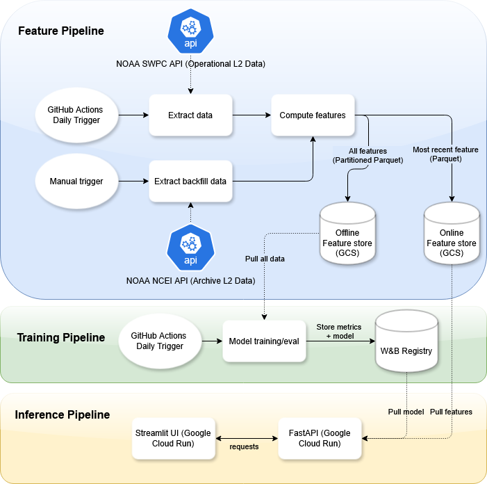

# Solar Flux ML Pipeline


<p align="center">
  
</p>

The Solar Flare Early Warning System is an automated pipeline, forecasting, whether the maximum Solar X-Ray Flux will exceed the M-Class threshold ($\ge 10^{-5} W/m^2$) within the next 24-hour window. By engineering rolling features from dynamic GOES satellite data, the system predicts maximum flux values to serve as a alert mechanism for potential satellite or radio disruptions. This repository contains all the code to orchestrate data pipelines, model training, and online inference using **Google Cloud Platform**, **GitHub Actions**, and **Weights & Biases (W&B)**.

---

## Prerequisites

Before you begin, ensure you have the following:

- **Google Cloud Platform (GCP)** account with billing enabled
- **[Terraform](https://www.terraform.io/downloads)** installed locally
- **[gcloud CLI](https://cloud.google.com/sdk/docs/install)** installed locally
- **[Weights & Biases (W&B)](https://wandb.ai/)** account for model registry and tracking
- **GitHub** account

---

## Setup & Deployment Guide

### 1. Fork the Repository
Start by forking this repository to your own GitHub account so you can run GitHub Actions and manage your own deployments.

### 2. Prepare Google Cloud
1. **Create a new Google Cloud Project.** Note down the Project ID.
2. **Enable necessary APIs.** You can do this via the Google Cloud Console or using the `gcloud` CLI:
   ```bash
   gcloud config set project YOUR_PROJECT_ID

   gcloud services enable run.googleapis.com \
                          artifactregistry.googleapis.com \
                          iam.googleapis.com \
                          cloudresourcemanager.googleapis.com \
                          secretmanager.googleapis.com \
                          sts.googleapis.com
   ```
3. **Authenticate locally** with `gcloud` so Terraform can provision resources on your behalf:
   ```bash
   gcloud auth application-default login
   ```

### 3. Create a GitHub Fine-Grained PAT
Terraform needs to populate your GitHub repository with secrets and variables for the Actions workflows.
1. Go to your GitHub Settings > Developer settings > Personal access tokens > **Fine-grained tokens**.
2. Create a new token scoped to your forked repository.
3. Grant **Read and Write** access for both **Secrets** and **Variables**.
4. Save the generated token.

### 4. Configure Terraform
1. Navigate to the `terraform` directory:
   ```bash
   cd terraform
   ```
2. Copy the example variables file:
   ```bash
   cp terraform.tfvars.example terraform.tfvars
   ```
3. Edit `terraform.tfvars` with your specific values. It should look like this:
   ```hcl
   project              = "your-gcp-project-id"
   github_repo_owner    = "your-github-username"
   github_repo_owner_id = 12345678  # Your GitHub user/org ID
   github_repo_name     = "solar-flux-ml-pipeline"
   github_token         = "github_pat_xxx_yyy_zzz"
   wandb_entity         = "your-wandb-username"
   wandb_project        = "solar-flux-ml-pipeline"
   wandb_api_key        = "your_wandb_api_key"
   ```

   The GitHub user id can be easily retrieved using the GitHub API:
   ```
   https://api.github.com/users/your_github_user_name
   ```

### 5. Deploy Infrastructure
Provision the required Artifact Registry, Cloud Run services, IAM roles, and GitHub Secrets:
1. Initialize Terraform:
   ```bash
   terraform init
   ```
2. Review the planned changes:
   ```bash
   terraform plan
   ```
3. Apply the infrastructure:
   ```bash
   terraform apply
   ```
   *(Type `yes` when prompted to confirm the deployment)*

### 6. Run GitHub Actions Setup
Once the Terraform deployment finishes successfully, the foundational infrastructure and GitHub secrets are ready.
1. Navigate to your forked repository on GitHub.
2. Go to the **Actions** tab.
3. Select the **`setup`** workflow from the left sidebar.
4. Click **Run workflow**.

This setup action will initialize the pipeline, build and deploy necessary Docker images, backfill data, and perform an initial training run.

---
